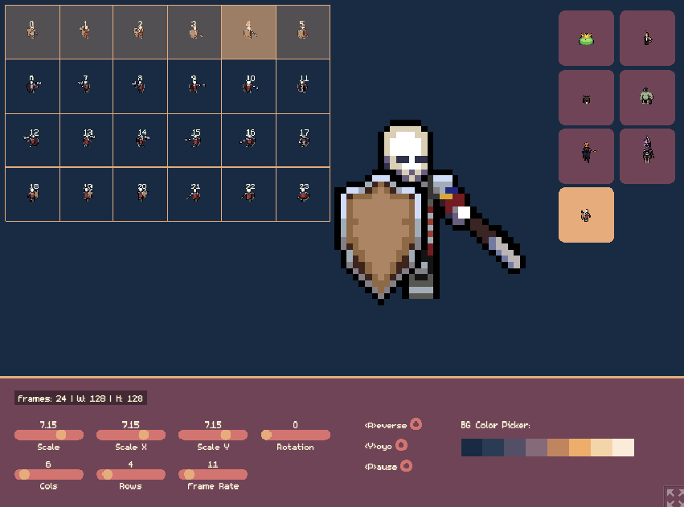

# Sprite Player

A sprite animation previewer built with Phaser 3.

**Live Demo**: [papayaah.itch.io/sprite-player](https://papayaah.itch.io/sprite-player)

## Features

- Drag and drop spritesheet files (PNG/JPG).
- Adjustable grid configuration (Columns and Rows).
- Uniform scaling via mouse wheel or sliders (0.1x to 10.0x).
- Playback controls: Pause, Reverse, and Yoyo.
- History panel for up to 20 recent sprites.
- Technical info display: Frame dimensions and total frame count.
- Optimized for pixel art rendering.
- Automatic storage cleanup.

## Requirements

[Node.js](https://nodejs.org) is required.

## Commands

- `npm install`: Install dependencies.
- `npm start`: Start development server.
- `npm run build`: Build for production.

## How to Use

1.  Drag and drop a spritesheet file onto the application.
2.  Set the Columns and Rows sliders to match the sheet layout.
3.  Use the playback and scale controls to preview the animation.
4.  Switch between recently loaded sprites using the panel on the right.

## License

MIT
